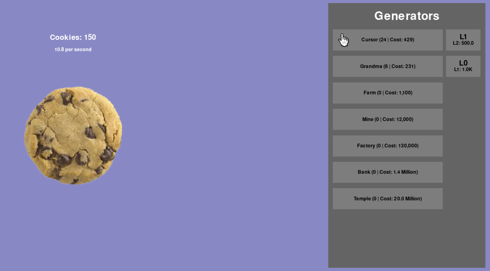

# Cookie Clicker in Python

A simple recreation of the game [Cookie Clicker](https://cookieclicker.com/), using [PyGame](https://www.pygame.org/).

_Version 0.1.0:_

---

## Information

- Version: 0.1.0
  - A detailed list of changes can be found in `info/CHANGELOG.md`.
- Author: Lucas Ryan ([LinkedIn](https://www.linkedin.com/in/lucasryan360/))
- License: [Apache 2.0](https://www.apache.org/licenses/LICENSE-2.0)
- I am not the author or owner of any of the assets used in this project. The source for each sprite 
is listed and can be found in `info/SOURCES.md`. 

---

## Setup Guide

1. Install **Python 3.13.5** or higher (can use `brew`/`apt` to install)
2. Clone the repository
3. Install the required packages using `pip install -r requirements.txt`
    - Currently, the only required external module is `pygame 2.6.1`
4. Configure settings in `core/config.py`
5. Run `python run.py`

---

